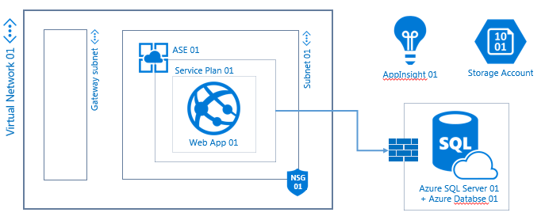
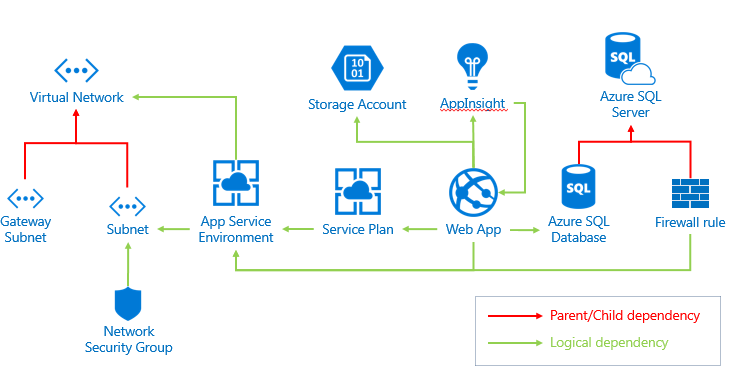

# AzureHosting : "Reference Architecture 1" templates and Scripts

## Description
This repository contains Templates and scripts to provision Azure resources required for "Reference Architecture 1". The deployment of these templates is done in three incremental steps creating three Resource Groups which holds 1 instance of each necessary resources.

The deployment in three steps creates the following resources :
* **Network resource group** :
  * 1 Network Security Group
  * 1 Virtual Network
    * 1 Subnet
    * 1 Gateway subnet
* **ASE resource group** :
  * 1 App Service Environment
* **Application resource group** :
  * 1 Azure SQL Server
    * 1 Firewall rule
    * 1 Azure SQL Database v12
  * 1 App Service Plan
  * 1 Web App
  * 1 App Insight
  * 1 Storage Account

## Content
The templates and scripts are organized as following :
* **0-Shared** : contains the common scripts used at each steps
* **1-Network** : contains script and template to deploy the Network resource group
* **2-ASE** : contains script and template to deploy the ASE resource group
* **3-Application** : contains script and template to deploy the Application resource group
* **initProxy.ps1** : contains the function to configure the proxy for the current PowerShell session
* **parameters.json** : contains all the parameters to be filled in and used at each steps

## Usage (manual execution)

### Deployment steps
* Download and extract all files locally
* Start your preferred PowerShell tool (ISE, PowerShell console)
* Change the current directory to the top folder containing **initProxy.ps1**
* Run **initProxy.ps1** if executed from an AXA/ATS registered workstation 
* Fill-in the **parameter.json** with your custom value
* (optional) Add new resource instances into the templates **template.[NameOfTheStep].json**
* Change the current directory to the folder **X-[NameOfTheStep]** related to the step to deploy
* Run the **execute-azuredeploy.[NameOfTheStep].ps1**

### Add more resource instances
To add more instances of a particular resource, please report to the README of the related step. The Azure Resource Management API is intended to deploy resources incrementally, therefore it is best to deploy additional resources by updating the same base templates and add those resources to it at each deployment.
Please note that individual resources already deployed are left untouched as long as their section has not been updated, thus deploying the same templates growing incrementally with new resources or updated resources is a good way to keep a reference of the current configuration.

**Important** : make sure to take dependencies into account when adding instancies, see bellow the dependency map for theresources.

#### Dependency map

## Parameters List

**Important** : parameters must follow the published [naming and tagging convention for Azure environments](https://axa365.sharepoint.com/sites/AXACloud/CF/Documents/01.%20Teams/02.%20PaaS/AzurePaaS%20Foundry/ops18%20-%20namingConvention%20v1.0.pptx?d=wba26b0e415c040a58994b7c1a7c4b2c1).

### General

#### subscription_id
* Description: ID of the subscription to which deploy to
* Type: String 
* allowedValues: Unrestricted
* ex: 17295c84-15bb-41ed-b439-299c3c50a05f

#### netResourceGroup_index
* Description: Identifies the resource group index for the network resources. It must be unique within a given Subscription.
* Type: String
* allowedValues: “rgp” + 2 numeric number
* ex: rgp01

#### aseResourceGroup_index
* Description: Identifies the resource group index for the App Service Environment. It must be unique within a given Subscription.
* Type: String
* allowedValues: “rgp” + 2 numeric number
* ex: rgp01

#### appResourceGroup_index
* Description: Identifies the resource group index for the Application resources. It must be unique within a given Subscription.
* Type: String
* allowedValues: “rgp” + 2 numeric number
* ex: rgp01

#### location_name
* Description: Name of the region for the deployment.
* Type: String
* allowedValues : Unrestricted (see naming convention)

#### location_code
* Description: code of the region for the deployment.
* Type: String
* allowedValues : Unrestricted (see naming convention)
* ex: euw

#### opco_code
* Description: Identifies the opco, It must be unique within the set of opcos
* Type: String
* allowedValues : Unrestricted (see naming convention)
* ex: ats

#### project_code 
* Description: Identifies the project the ressource is related to. It must be unique within a given opco
* Type: String
* allowedValues : Unrestricted (see naming convention)
* ex: acc

#### app_code 
* Description: Identifies the application the resource is related to. It must be unique within a given project.
* Type: String
* allowedValues : Unrestricted (see naming convention)
* ex: app

#### env_code 
* Description: Identifies the environment that hosts the resource.
* Type: String
* allowedValues: dm, dv, re, st, pp, pr
* ex: dm

#### corridor_code 
* Description: Identifies a corridor.
* Type: String
* allowedValues: Unrestricted (see naming convention)
* ex: a

### Tags

#### rev_number
* Description: Identifies the build/release.
* Type: String
* allowedValues: Unrestricted (see tagging convention)
* ex: 2.0.1-1.13AEC

#### dcs_code
* Description: Identifies a department within an opco.
* Type: String
* allowedValues: Unrestricted (see tagging convention)
* ex: FIN

#### client_billingCode
* Description: Identifies financial client code.
* Type: String
* allowedValues: Unrestricted (see tagging convention)
* ex: AFA01

#### project_billingCode
* Description: Identifies financial project code.
* Type: String
* allowedValues: Unrestricted (see tagging convention)
* ex: 163772

#### start_time
* Description: Identifies a time to start the resource (in CRON format).
* Type: String
* allowedValues: Unrestricted (see tagging convention)
* ex: 0 8 ***

#### stop_time
* Description: Identifies a time to stop the resource (in CRON format).
* Type: String
* allowedValues: Unrestricted (see tagging convention)
* ex: 0 19 ***

#### launch_time
* Description: Identifies the time the resource was created.
* Type: String
* allowedValues: Unrestricted (see tagging convention)
* ex: 1453739311

#### time_to_live
* Description: Identifies the time to live of the resource (in seconds from the launch time.
* Type: String
* allowedValues: Unrestricted (see tagging convention)
* ex: 1453739311

### Network & Security 

#### nsg_01_index 
* Description: Identifies the Network Security Group #1 associated with subnet #1. It must be unique within a resource group.
* Type: String
* allowedValues: “nsg” + 2 numeric number
* ex: nsg01

#### vnet_01_index 
* Description: Identifies the Virtual Network #1. It must be unique within a resource group.
* Type: String
* allowedValues: “net” + 2 numeric number
* ex: net01

#### vnet_01_range 
* Description: IP address plan for the Virtual Network #1.
* Type: String
* allowedValues: Unrestricted
* ex: 10.3.0.0/16

#### subnet_01_index 
* Description: Identifies the Subnet #1. It must be unique within a given Virtual network.
* Type: String
* allowedValues: “sub” + 2 numeric number
* ex: sub01

#### subnet_01_range 
* Description: IP address plan for the Subnet #1. 
* Type: String
* allowedValues: Unrestricted
* ex: 10.3.0.0/24

#### gatewaySubnet_range 
* Description: IP address plan for the Gateway Subnet. It must be unique within a given Virtual network and cannot host any machine.
* Type: String
* allowedValues: Unrestricted
* ex: 10.3.3.0/24

#### dns1_ip 
* Description: Ip address of the dns server 
* Type: String
* allowedValues: Unrestricted
* ex: 172.20.0.1

#### dns2_ip 
* Description: Ip address of the dns server
* Type: String
* allowedValues: Unrestricted
* ex: 172.20.0.2

### App Service Environment

#### ase_01_index 
* Description: Identifies the App Service Environment #1. It must be unique across all subscription.
* Type: String
* allowedValues: “ase” + 2 numeric number
* ex: ase01

#### ase_01_DNS_Suffix 
* Description: Identifies the App Service Environment #1 dns suffix.
* Type: String
* allowedValues: “ase” + 2 numeric number
* ex: ase01

#### ase_01_publicIp_count 
* Description: Number of public IP addresses for App Service Environment #1.
* Type: int
* allowedValues: Unrestricted
* ex:0
* Recommended value 0 for internal ASE

#### ase_01_frontEnd_count 
* Description: Number of instances in the front-end pool of App Service Environment #1.
* Type: int
* allowedValues: inferior or equal to '2'
* ex:2

#### ase_01_frontEnd_tier 
* Description: Instance size in the front-end pool of App Service Environment #1.
* Type: String
* allowedValues: Medium, Large, ExtraLarge

#### ase_01_workerPoolOne_count 
* Description: Number of instances in first worker pool of App Service Environment #1.
* Type: int
* allowedValues: Unrestricted
* ex: 3

#### ase_01_workerPoolOne_tier 
* Description: Instance size in first worker pool of App Service Environment #1.
* Type: String
* allowedValues: Small, Medium, Large, ExtraLarge

#### ase_01_workerPoolTwo_count 
* Description: Number of instances in second worker pool of App Service Environment #1.
* Type: int
* allowedValues: Unrestricted
* ex: 3

#### ase_01_workerPoolTwo_tier 
* Description: Instance size in second worker pool of App Service Environment #1.
* Type: String
* allowedValues: Small, Medium, Large, ExtraLarge

#### ase_01_workerPoolThree_count 
* Description: Number of instances in third worker pool of App Service Environment #1.
* Type: int
* allowedValues: Unrestricted
* ex: 3

#### ase_01_workerPoolThree_tier 
* Description: Instance size in third worker pool of App Service Environment #1.
* Type: String
* allowedValues: Small, Medium, Large, ExtraLarge

### Application

#### webApp_01_index 
* Description: Identifies the Web App #1. 
* Type: String
* allowedValues: “web” + 2 numeric number
* ex: web01

#### servicePlan_01_index 
* Description: Identifies the App Service Plan #1. 
* Type: String
* allowedValues: “pln” + 2 numeric number
* ex: pln01

#### servicePlan_01_sku 
* Description: Identify the Service Plan #1 SKU. It must be premium to be integrated to an ASE.
* Type: String
* allowedValues: Premium

#### servicePlan_01_worker_size 
* Description: Worker size in the Service Plan #1
* Type: String
* allowedValues: 0, 1 ,2
* ex:0

#### diagStorage_index 
* Description: Identifies the storage account used for this webapp and App Insight. 
* Type: String
* allowedValues: “sto” + 2 numeric number
* ex: sto01

#### diagStorage_type 
* Description: Identify the Type of storage account 
* Type: String
* allowedValues: Standard_LRS, Standard_ZRS, Standard_GRS, Standard_RAGRS, Premium_LRS

#### SQLsrv_01_index 
* Description: Identifies the SQL server #1. 
* Type: String
* allowedValues: “sql” + 2 numeric number
* ex: sql01

#### SQLsrv_01_login 
* Description: SQL server #1 Admin login name
* Type: String
* allowedValues: Unrestricted

#### SQLsrv_01_password
* Description: SQl Server #1 Admin password
* Type: securestring
* allowedValues: Unrestricted

#### SQLdb_01_index 
* Description: Identifies the SQL DataBase #1. 
* Type: String
* allowedValues: “sdb” + 2 numeric number
* ex: sdb01

#### SQLdb_01_collation 
* Description: Identifies the collation for SQL DataBase #1.
* Type: String
* minLength: 1
* allowedValues: Unrestricted

#### SQLdb_01_tier 
* Description: Identifies the tier for SQL DataBase #1.
* Type: String
* allowedValues: Basic, Standard, Premium

#### SQLdb_01_size 
* Description: Identifies the size for SQL DataBase #1.
* Type: String
* allowedValues: Basic, S0, S1, S2, P1, P2, P3

#### SQLFirewall_rule_01_name 
* Description: Identify the name of the SQL Firewall rule #1. This first rule must be used to allow traffic from the ASE public IP.
* Type: String
* allowedValues: Unrestricted
* ex: AllowInboundSQL-ASE

#### SQLFirewallRule_01_publicIp 
* Description: : Identify the allowed IP address of the SQL Firewall rule #1. This first rule must be used to allow traffic from the ASE public IP, this IP can only be recovered in the ASE "Properties > Outbound IP Addresses"
* Type: String
* allowedValues: Unrestricted
* ex: 104.40.187.207

#### appInsight_01_disabled 
* Description: Identify whether AppInsight is disable or not (false > enable, true > disable)
* Type: bool
* allowedValues false, true

#### appInsight_01_index 
* Description: Identifies the AppInsight #1. 
* Type: String
* allowedValues: “ins” + 2 numeric number
* ex: ins01

#### appInsight_01_kind 
* Description: Define the type of App for AppInsight #1
* Type: String
* allowedValues: web, java, other

